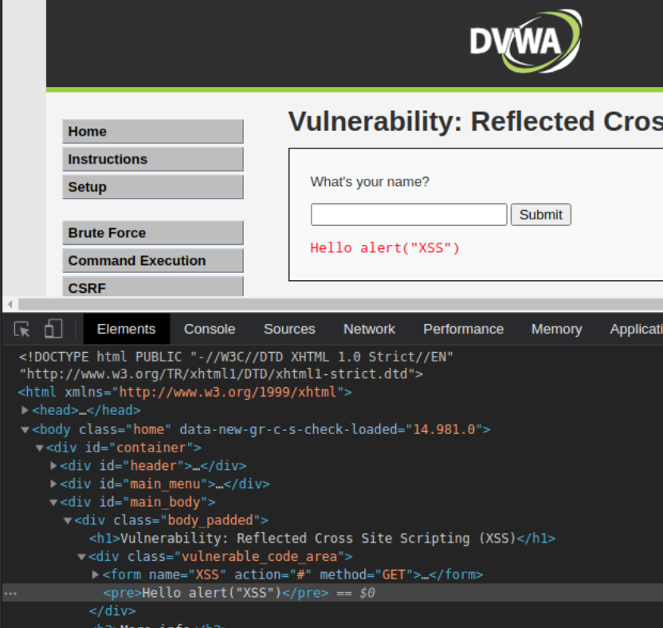

## Relected XSS Xplained

Arises when an application recieved data in HTTP request and includes it in the response in an unsafe way. One can inject malicious code in the query function and then share that URL.

```http
https://ac751fca1eecafd88054d23b00ec00bf.web-security-academy.net/?search=TEST
```

`?search=TEST`  results in the application showing:


Since, the search query displays on the webpage as `<h1>1 search results for 'TEST'</h1>`, searching for ``<script>alert(1)</script>`` will run 
```html
<h1>1 search results for <script>alert(1)</script></h1>
```
and generate an alert. 

The search query also shows up in the URL: `https://ac751fca1eecafd88054d23b00ec00bf.web-security-academy.net/?search=TEST` meaning that one can craft an XSS payload and share the URL.

## Impact 
Since, the script can be controlled by the attacker, he can fully control and access the victim's user on the webapp. To deliver the attack, the links can placed in websites, tweets etc.

It's less impactful than Stored XSS due to the need of the external delivery mechanism.

## How to find XSS

- Test every endpoint withing application's HTTP requests. This includes parameters or other data withing HTTP and the URL file path. 
- Submit random characters to determine whether the value is reflected in the response. Around 8 characters. 
- Determine the reflected location, in HTML tags, or JS etc.
- Test a payload using Repeater. 
- Test attack in browser.

## Example 1: DVWA 

### Easy

Try the payload of ``<script>alert("XSS")</script>``


Inputs are rendered in ``<pre>`` tags. Inputting a simple JavaScript would interpret and run it. gg Ez. 


### Medium

Trying the same payload ``<script>alert("XSS")</script>``



` <script></script>` tags have been removed. Done by a WAF filter. To bypass/evade WAFs, there are a lot of resources online. Basic methodology would be to try out different tags and combos. 

[OWASP XSS Filter Evasion Cheatsheet](https://owasp.org/www-community/xss-filter-evasion-cheatsheet)

Trying out `<a>` and `` tags would lead to: 


Hence, we gain the knowledge that `<script>` tags are being filtered. Where the filter is also decides the level of security. 

Do `<scRipt>alert("XSS")</scrIpT>` and boom, you get an alert.

