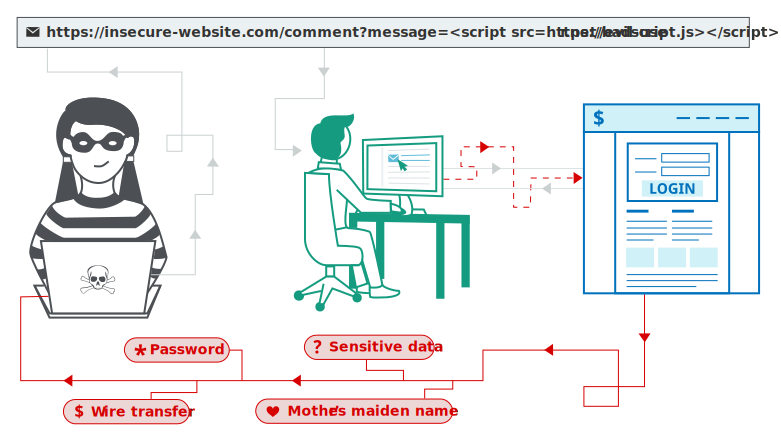

## XSS Resources 

---


## What is XSS?

A web sec vulnerabiltiy which allows an attacker to compromise the interactions that users have with a vulnerable application. Allows an attacker to inject malicious code, which helps to bypass and impersonate other users. 

This injected code, afffects and runs on the users on the website and has no real effect on the web server whatsoever. It affects the *client* and not the *server*.

This means the attacker circumvents the same origin policy.

**Same-Origin Policy**: 
A security mechnism that restricts how a document or script loaded from one origin, interacts with other resources. Helps in the isolation of malicious files and scripts.
It is a core security feature which stops one website from reading or writing data to another.

Checks for, ==Protocol, Host and Port== for each origin before allowing it to cross origin read/write.

## How does XSS work?

Manipulates a vulnerable website so that it returns malicious JavaScript to the users. When a user visits the webapp, this JS runs allowing the Attacker to compromise that session with the victim.



## What are the types of XSS attacks?

1. **[[Reflected XSS]]**: where the malicious script comes from the current HTTP request. It runs when a specifically crafted URL is run
2. **[[Stored XSS]]**: where the malicious script comes from the website's database.
3. **[[DOM-Based XSS]]**: where the vulnerability exists in the JS on the client, with no communication to web-servers. Servers may have XSS sanitation but client-side doesn't then this allows Attacker to control the DOM using JS.

## Reflected XSS

Arises when application recieves data in an HTTP request and includes the data within the response in an unsafe way. Eg.

```html
https://insecure-website.com/status?message=All+is+well.
<p>Status: All is well.</p>
```

No processing of data is done, hence one can craft a URL like;

```html
https://insecure-website.com/status?message=<script>/*+Bad+stuff+here...+*/</script>
<p>Status: <script>/* Bad stuff here... */</script></p>
```

The ``<script>`` tag gets executed once the victim loads this specific URL
	

## Stored XSS

Arises when an application recieves data from an untrusted source and includes that data in its later HTTP responsed insecurely. Eg, in a blog post comment section. Say a message board application allows you to post messages.

```html
<p><script>/* Bad stuff here... */</script></p>
```

This script gets stored on the website as a message and runs on anyone who loads this page containing this message.

## [[XSS Contexts]]
XSS Contexts are important to identify the various parameters of XSS and how it takes place.

## DOM-Based XSS

Arises when an application contains some client-side JS processing data in an unsafe way (writing it back to the DOM). If the attacker controls the calue of the input field, they can craft malicious JS that causes their own script to execute.

---
## Where to Study??
[[Important Labs and Links]](Important Labs and Links.md)


